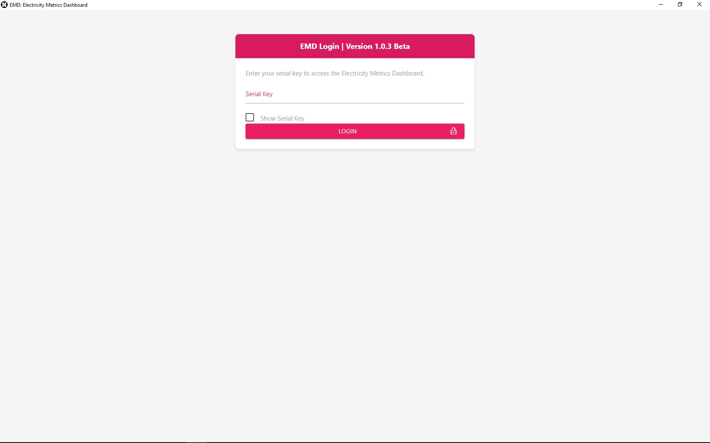
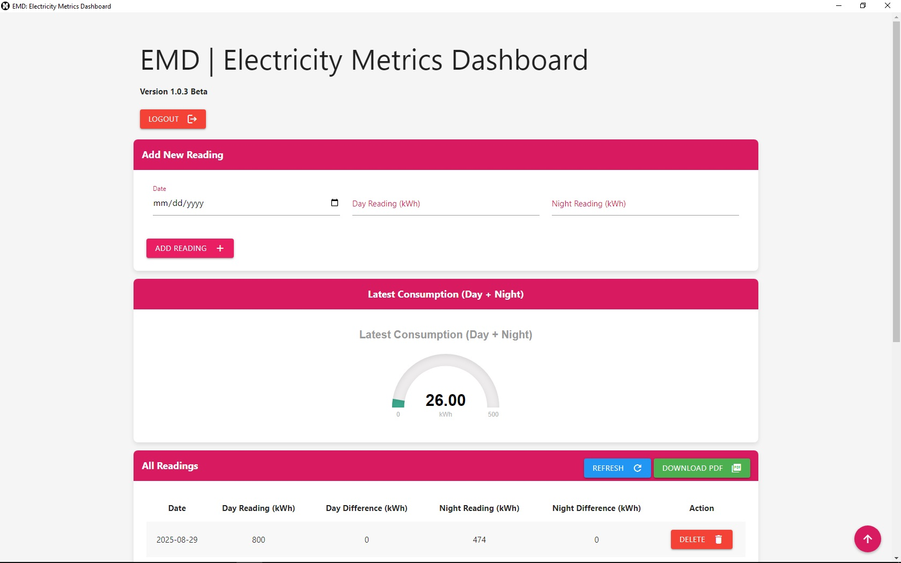

# Electricity Metrics Dashboard
# V. 1.0.2 Beta

# App
EMD | Electricity Metrics Dashboard

A application that allows you to register your electricity meter readings every month. With this application you can check for any exclusions in the current HEDNO metering. There is a possibility for dual-zone Day – Night meters. Calculates current month previous month and annual total electricity consumption.

# Beta Tester
Do you want to be among the first to try the application, become a beta tester!
please <a href="https://hauhet.co/contact/" rel="noopener">contact us.</a>

## Contents

   * Project Overview
   * Problem Statement and approach to solution
   * Metrics 
   * Dataset 
   * Exploratory Data Analysis and Data processing
   * Model implementation
   * Improvement and evaluation
   * Prediction and web application
   * Improvement and conclusion
   * acknowledgement

 

 

# Technology
 * PHP
 * JavaScript
 * jQuery
 * Materialize CSS
 * mySQL

# Requirements
 * Windows 7/8/10/11
 * x64 (64-bit or x32 (32-bit)
 * RAM 4GB
 * Hard Disc Space 300MB

### Copyright

HauHet plc. © 2023-2025. All Rights Reserved. [HauHet plc.](https://hauhet.co/)
