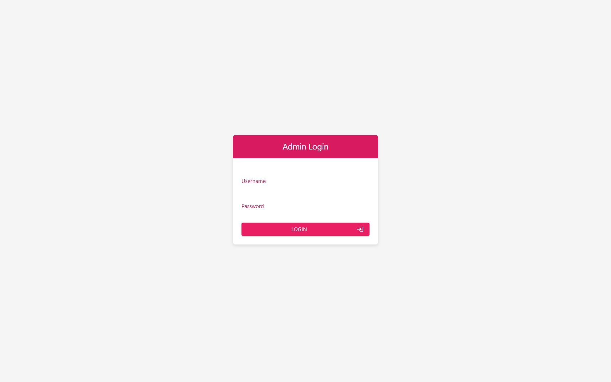
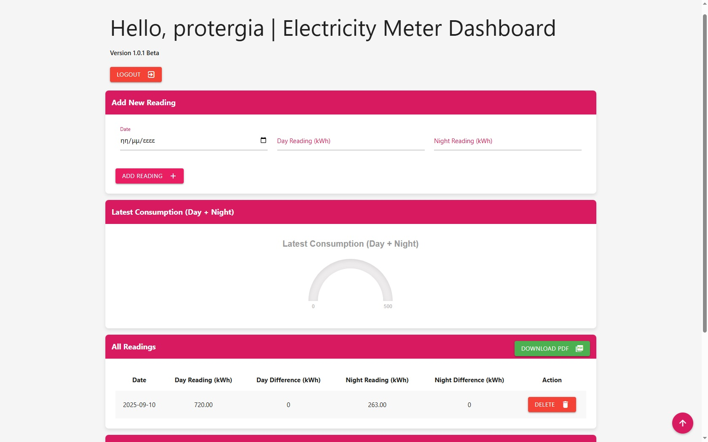

# Electricity Metrics Dashboard
# V. 1.0.2 Beta

# Web App
Electricity Metrics Dashboard

A web application that allows you to register your electricity meter readings every month.
With this application you can check for any exclusions in the current HEDNO metering.
There is a possibility for dual-zone Day - Night meters.
Calculates current month previous month and annual total electricity consumption.

## Contents

   * Project Overview
   * Problem Statement and approach to solution
   * Metrics 
   * Dataset 
   * Exploratory Data Analysis and Data processing
   * Model implementation
   * Improvement and evaluation
   * Prediction and web application
   * Improvement and conclusion
   * acknowledgement

 

 

# Technology
 * PHP
 * JavaScript
 * jQuery
 * Materialize CSS
 * mySQL

# Requirements
 * Linux
 * Nginx or Apache Server
 * PHP 7/8
 * mySQL

### Copyright

HauHet plc. © 2023-2025. All Rights Reserved. [HauHet plc.](https://hauhet.co/)
